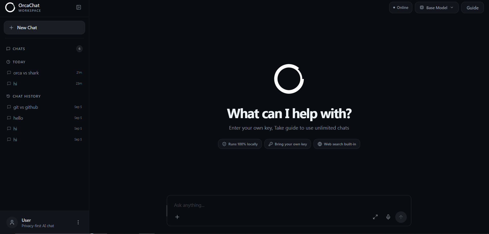
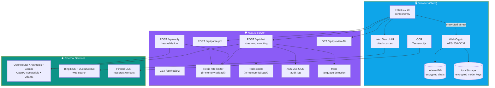
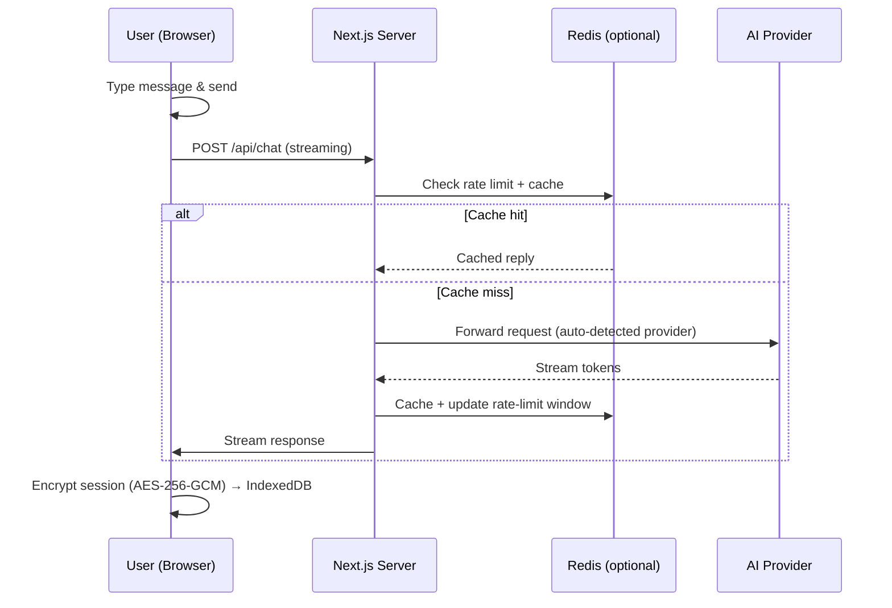

<div align="center">

# OrcaChat

**A privacy-first AI chat that runs on your device and keeps your conversations local.**

Built with **Next.js 16**, **React 19**, and **TypeScript**. Chat history and model keys stay encrypted in your browser; the server only proxies model requests and never stores your conversations.

</div>

---

## 📸 Screenshot



---

## ✨ Highlights

- **Privacy by default** — conversations are stored **only in your browser** (IndexedDB), encrypted at rest with **AES-256-GCM** via Web Crypto. Model API keys you add are also encrypted before they touch storage.
- **Free tier included** — try it immediately without adding any key (shared OpenRouter credits; 10 free replies per new chat).
- **Bring any AI model** — connect your own model from any provider:
  - OpenAI-compatible APIs (OpenAI, DeepSeek, Groq, Mistral, OpenRouter, Ollama…)
  - Anthropic (Claude) Messages API
  - Google Gemini
  - Custom base URLs and models with server-side key verification against the real provider.
  - The provider is auto-detected from your API key prefix, base URL, or model name (OpenRouter, Anthropic, Gemini, Mistral, Hugging Face, DeepSeek, X.AI, Groq, Together, Fireworks, local Ollama/LM Studio…).
- **Web search** — optional built-in search with cited sources in answers (Bing RSS + DuckDuckGo).
- **File & image understanding**
  - PDF parsing, Word (.docx) via Mammoth, Excel (.xlsx) via SheetJS
  - Client-side OCR of images (Tesseract.js, loaded lazily) — image text works with any model, vision-capable or not.
- **Privacy-friendly retention** — automatic deletion of old chats keeps your browser storage tidy, while **pinned** conversations stay until you remove them.
- **Installable web app** — web-app manifest (add-to-home-screen), dark/light themes, responsive on mobile and desktop.

## 🏗️ System Architecture



### Key data flows



### Layer responsibilities

| Layer | Responsibility |
| --- | --- |
| **Presentation** | React chat shell, markdown rendering, sidebar, settings, previews (`components/`) |
| **Client logic** | Chat crypto, storage, auto-delete & pinning, free-tier budgets, OCR, web search (`lib/`) |
| **API layer** | Streaming chat, provider verification, PDF parsing, file previews, health checks (`app/api/`) |
| **Infrastructure** | Redis-accelerated rate limiting & caching (graceful in-memory fallback), optional audit log |
| **External** | AI providers (auto-detected), web search, pinned OCR CDN, browser-only persistence |

> **Privacy boundary** — all conversation data and user-provided API keys live **only in the browser**, encrypted with AES-256-GCM. The server proxies model requests and never persists message content.

## 📦 Installation

### Option A — Use it right now (no install)

- Just open the hosted instance — no account, no API key needed to start. Everything runs in your browser.
- Link: [http://orcachatone.vercel.app](http://orcachatone.vercel.app)


### Option B — Run locally (npm)

```bash
npm install
cp .env.example .env.local   # optional — see Configuration below
npm run dev
```

Then open [http://localhost:3000](http://localhost:3000). Without any keys, the built-in free tier still works.

### Option C — Self-host with Docker

```bash
docker build -t orcachat .
docker run -d -p 3000:3000 \
  -e REDIS_URL=redis://your-redis:6379 \
  -e OPENROUTER_API_KEY_1=sk-or-v1-... \
  --name orcachat \
  orcachat
```

Or deploy the standalone build to any Node.js 20+ host by copying the `.next/standalone`, `.next/static`, and `public` directories and running `node server.js`.

### Option D — Deploy to Vercel

```bash
npm i -g vercel
vercel --prod
```

Set your [environment variables](#configuration) in the Vercel dashboard — never commit real keys.

## 🧱 Tech Stack

| Layer | Tech |
| --- | --- |
| Framework | [Next.js 16](https://nextjs.org) (App Router, Turbopack) |
| UI | React 19, [Tailwind CSS 4](https://tailwindcss.com), lucide-react |
| Rendering | react-markdown, remark-gfm, react-syntax-highlighter |
| Storage | IndexedDB (chats), localStorage (settings/models) — encrypted |
| Server | Node.js route handlers, ioredis (optional cache/rate limiting) |
| Files | pdf-parse, pdfjs-dist, mammoth, xlsx, tesseract.js |
| Language detection | franc (offline, server-only) |
| Quality | TypeScript, ESLint, Vitest |

## 🚀 Getting Started

### Prerequisites

- Node.js **20+** (24.x recommended)
- npm
- (Optional) A Redis instance for cache + distributed rate limiting — falls back to in-memory automatically when unset

### Install & run

```bash
npm install
cp .env.example .env.local   # fill in your keys
npm run dev
```

Open [http://localhost:3000](http://localhost:3000).

### Configuration

Copy `.env.example` to `.env.local` and fill in the values:

| Variable | Required | Description |
| --- | --- | --- |
| `OPENROUTER_API_KEY_1…5` | Yes* | OpenRouter keys for the shared free tier (tried in order if one fails/rate-limits). *Skip all five to disable the free tier and force users to bring their own model. |
| `NEXT_PUBLIC_APP_URL` | Yes | Public URL of the deployed app. |
| `REDIS_URL` | No | Redis connection string for cache & rate limiting (in-memory fallback otherwise). |
| `RATE_LIMIT_MAX_REQUESTS` | No | Per-user request cap for the rate limiter window. |
| `RATE_LIMIT_WINDOW` | No | Sliding-window length in milliseconds. |
| `ENABLE_WEB_SEARCH` | No | Toggle the built-in web search feature. |
| `ENABLE_FILE_UPLOAD` | No | Toggle file upload (PDF/DOCX/XLSX/images). |
| `AUDIT_LOG_KEY` | No | Encrypts the optional audit log (AES-256-GCM, metadata only). Unset = logging disabled. |
| `AUDIT_LOG_DIR` | No | Directory for the audit log. |

> All key variables carried by the user in the browser are **never** sent to or stored on the server — custom model keys are verified server-side via the provider and kept in the browser only.

### Scripts

```bash
npm run dev      # development server
npm run build    # production build
npm run start    # serve the production build
npm run lint     # ESLint
npm run test     # Vitest unit tests
```

## 🔌 API Endpoints

| Endpoint | Description |
| --- | --- |
| `POST /api/chat` | Streams LLM responses; multi-provider routing, caching, input validation, rate limiting. |
| `POST /api/verify` | Validates a user API key by probing the real provider (nothing key-shaped is logged). |
| `POST /api/parse-pdf` | Extracts text from uploaded PDFs (throttled). |
| `GET /api/preview-file` | Sanitized in-app preview of uploaded files. |
| `GET /api/healthz` | Health check for uptime monitors. |

## 🛡️ Security & Privacy Model

- **Encrypted at rest** — chat sessions and model keys are AES-256-GCM encrypted before being written to browser storage.
- **Server keeps nothing** — no message content or user data is persisted server-side.
- **Hardenend responses** — Content-Security-Policy, `X-Content-Type-Options`, `X-Frame-Options: DENY`, `Referrer-Policy: no-referrer`, and a restrictive `Permissions-Policy`.
- **Input guards** — request size limits, message/token caps, and sanitized error messages.
- **Rate limiting** — Redis sliding-window limiter (in-memory fallback) on chat, verification, and PDF endpoints.
- **Optional audit log** — metadata-only, AES-256-GCM encrypted at rest, fail-closed when disabled.
- **CSP-compatible OCR** — Tesseract workers and language data load from a pinned CDN.

## 📁 Project Structure

```
app/
├── api/              # Route handlers (chat, verify, parse-pdf, preview-file, healthz)
├── layout.tsx        # Root layout, fonts, PWA metadata
└── page.tsx          # Main chat shell
components/
├── Chat/             # Input, chat window, markdown renderer, previews
├── Sidebar/          # History, model manager, guide, user menu
├── Settings/         # Settings + privacy notice modal
└── UI/               # Shared UI primitives
lib/                  # Crypto, storage, security, providers, OCR, language detection
__tests__/            # Vitest unit tests (storage, auto-delete, boundaries, pinning)
```

## 🧪 Testing

```bash
npm test
```

The suite covers chat storage, session auto-delete and pinning, free-tier boundaries, and crypto round-trips using a real IndexedDB implementation.

## 📄 License

Released under the [MIT License](./LICENSE). OrcaChat is free to use, modify, and distribute — commercial use included.

---

**OrcaChat does not use your data.** No tracking, no analytics, no accounts, no backend storage. Your conversations stay yours.
